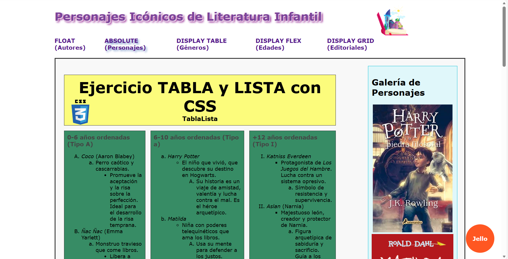

# edtech-literatura-infantil-daw

Proyecto de Literatura Infantil (9,8) - Desarrollo de una web responsive para la asignatura de Lenguajes de Marcas (1er Trimestre DAW).

📚 Literatura Infantil: Una Aventura Digital

📝 Descripción del Proyecto
Este sitio web es el proyecto integrador del primer trimestre de la asignatura Lenguajes de Marcas. El objetivo principal es demostrar el dominio de las diferentes técnicas de posicionamiento y maquetación en CSS3, utilizando como hilo conductor la literatura infantil.

Calificación obtenida: 9.8/10

🛠️ Despliegue Técnico (Maquetación Multi-técnica)
Para cumplir con los requisitos académicos, he implementado diferentes métodos de maquetación distribuidos estratégicamente:

-CSS Grid (Main Layout): Estructura principal de la página de inicio para una distribución de rejilla limpia y profesional.

-CSS Flexbox: Organización dinámica y responsive de las secciones por rangos de edades.

-CSS Float: Maquetación del formulario de contacto y registro sobre literatura infantil, asegurando el alineamiento de campos y etiquetas.

-Position Absolute: Control preciso y superposición de elementos visuales y personajes icónicos en secciones destacadas.

-Display Table: Estructura clásica aplicada para la organización de autores y géneros literarios.

Multimedia: Integración de directorios optimizados para audio, video, img y css.

Contenido Estructurado: Uso avanzado de tablas y listas anidadas para clasificar obras por rangos de edad (0-6, 6-10, +12 años).

👩‍🏫 Enfoque Profesional
Aunque el proyecto es estrictamente académico, he aplicado mis conocimientos como Maestra de Educación Infantil para seleccionar un contenido coherente y organizar la información de forma lógica, facilitando la comprensión de los géneros y autores más icónicos.

Proyecto desarrollado para el IES San Vicente - Diciembre 2025.

